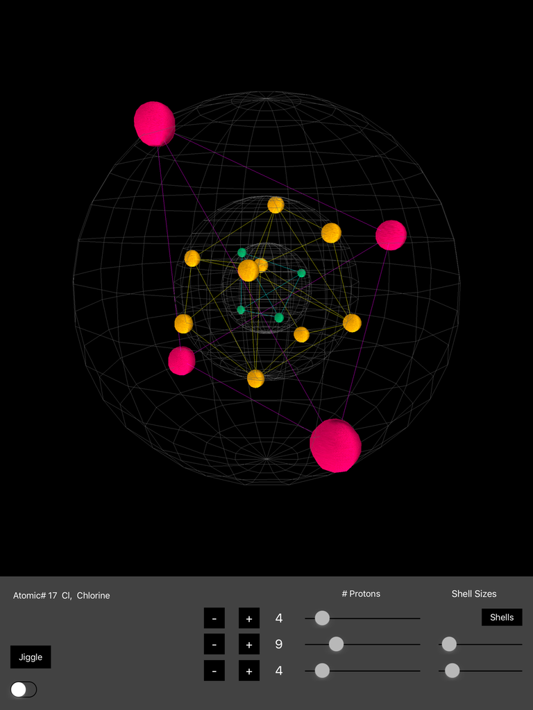

# Atom_IOS

Timothy Chan 3D Hull is described here: http://tmc.web.engr.illinois.edu/ch3d/ch3d.pdf

This app creates three proton shells, where you specify the number of protons in each.
The Swift code moves the protons around to maximize the distance between them, 
therefore spreading them evenly around their shell.
The Chan algorithm is then used to determine the hull of those proton positions.
Because they all reside on the surface of a sphere, all the protons are part of the hull.

The Chan algorithm is written with pointer heavy C++, and so it wasn't transated to Swift.
Instead this app demonstrates calling C++ from Swift.
The app also demonstrates the ArcBall algorithm, which makes rotations of 3D objects always
work correctly when you pan the view.

